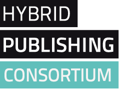
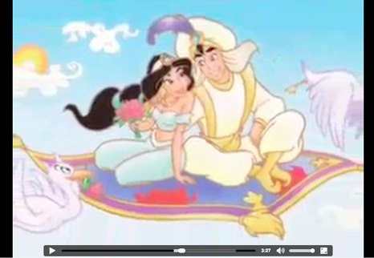
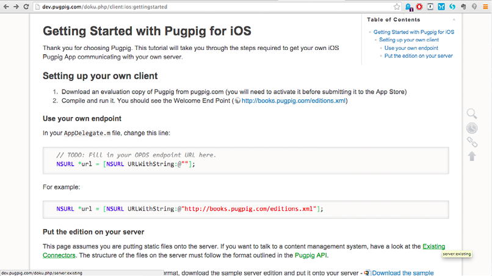
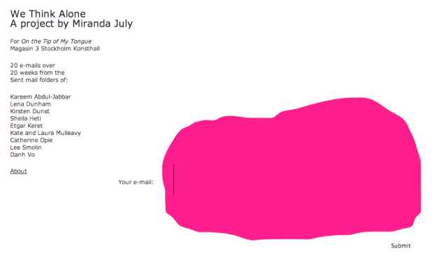
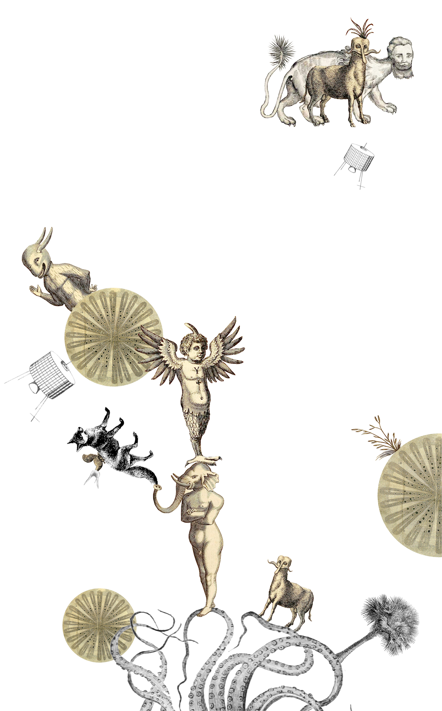
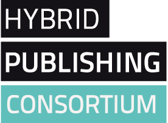

Title: A Publication Taxonomy–an initial guide to academic publishing types, inside and beyond Academe

A Hybrid Publishing Consortium Production

Concept and editorial: Simon Worthington & Christina Kral

Thanks for feedback and contributions to: Gray Hall,

Marcus Burkhardt, Pauline van Mourik Broekman

ISBN: 978-1-906496-70-8

Copyright © 2014 the authors

Creative Commons Attribution-ShareAlike 3.0 Germany \
(CC BY-SA 3.0 DE) \
http://creativecommons.org/licenses/by-sa/3.0/de/deed.en

Legend: This deed is used in the absence of an intellectual property
framework that represents the authors respective position on copyright.

The Hybrid Publishing Consortium is a project of the Hybrid Publishing
Lab in collaboration with partners and associates. The Hybrid Publishing
Lab is part of the Leuphana University of Lüneburg Innovation Incubator,
financed by the European Regional Development Fund and co-funded by the
German federal state of Lower Saxony.

http://consortium.io

http://cdc.leuphana.com/structure/hybrid-publishing-lab/

http://hybridpublishing.org/

How to Participate and the Publishing Process

GitHub and WikiPedia

The taxonomy originates and is maintained on a GitHub repository under a
Creative Commons ShareAlike licence. There is an open invitation for
contributions to the list and the list item descriptions.

A Publication Taxonomy base URL \
https://github.com/consortium/publication-taxonomy

The full list item descriptions can be found on WikiPedia and have been
collected together as a WikiPedia community book.
https://en.wikipedia.org/wiki/Book:A_Publication_Taxonomy

You are welcome to add to the list of entries and to edit the articles
on WikiPedia or on our GitHub repository if the WikiPedia bots or its
requirement of a Neutral Point of View (NPOV) proves too infuriating and
culturally shallow and you prefer a Critical Point of View (CPOV).

The issue and necessity of CPOV is outlined in the Institute of Network
Cultures’ publication from 2011, ‘Critical Point of View: A Wikipedia
Reader’, available online, see \
http://networkcultures.org/wpmu/cpov/

The Consortium and the Publishing Process

The collaborative list building project plays a role in the Consortium’s
research to understand how boundaries of publishing are shifting. The
taxonomy will be used and published in a variety of forms, on an ongoing
basis, with the Consortium team acting as list maintainers and editors.

Contents\

Introduction

Publication Taxonomy Summary

Part 1

Academic Publication and Document Types

Part 2

Unconventional publications (Academic

and Non-Academic), Hybrid and Experimental

(Blue Sky)

Publication Taxonomy Extended (descriptions)

A synopsis of edited and appended WikiPedia entries

A full list can be found here \
https://en.wikipedia.org/wiki/Book:A_Publication_Taxonomy

Part 1

Academic Publication and DocumentTypes

Part 2

Unconventional Publications (Academic and

Non-Academic), Hybrid and Experimental

(Blue Sky)

Publication Taxonomy Visual Appendix

An image gallery of publication examples

-   

Introduction

Dear Community,

Welcome to the Publication Taxonomy an exploratory listing project by
the Hybrid Publishing Consortium.

The Hybrid Publishing Consortium is the technology research arm of the
Hybrid Publishing Lab and is made up of a team of six interdisciplinary
researchers, developing open source software for multi-format
publishing. Creating an exploratory taxonomy of publication types plays
a role in our software design process helping us understand the
boundaries of publishing forms.

When the Consortium started to compile a list of the various types of
scholarly publications we had to keep in mind the challenge of a
continuously changing technology landscape. This meant moving to a so
called post-digital condition (although a contested term)–involving
parallel usage of various media types, a new collaborative paradigm, a
proliferation of tool sets and open access academic publishing.

To give some limits around what we define as a publication we agreed on
three very open parameters–(1) the act of making a document public, (2)
the involvement of textuality, and (3) a scholarly/academic orientation.

Acceleration best describes the overall condition for both the
development of publishing and the shaping of the emergent post-digital
scholar, blurring the distinction between the publishers workflow and
the scholars textual creation. The renegotiation of new roles for
publisher and scholar is one area where new publishing types emerge,
especially where the act of reading becomes a new textual creation. An
instability arises in the scholarly workflow and how the scholar is
organizing and adjusting her/his work steps within the post-digital
condition. It also means an expansion of the very definition what
constitutes a publication.

To add to the post-digital scholars’ palette of opportunities we
introduce dynamic publishing, an industry term to describe digital
automated processes in publishing–distribution, rights management and
reading analytics–to name a few areas.

Below you’ll find a list compiled of various publication types that can
currently be found on the publishing horizon. We tried to sort these
established & emerging types and find a common definition for each. We
did this to gain an overview of the forms available and the purposes
they serve. We were and are looking at classic forms of publishing as
well as hybrid forms, expanding to publications with enhanced options of
interaction and engagement, investigating the potential of modularity,
intermixing printed matter and digital media.

We came up with a list, parted into two sections:

PART 1 - conventional academic publications

PART 2 - unconventional, experimental types, appearing within and
outside of academia.

The second part is to create a pool of possible directions for the
publishing domain. As you can see this list not comprehensive. Therefore
please feel invited to share your comments and types of publications you
think relevant to include. For a better understanding of the options
we'd greatly appreciate if you added an example, in form of a link or
description.

You can direct your comments to Simon and Christina on our GitHub
repository, via email or our @HyPub Twitter handle.

We thank you for your analytical readership.

Enjoy,

Simon and Christina – The Consortium, Hybrid Publishing Lab

Contact details:

simon.worthington@leuphana.de

christina.kral@leuphana.de

@HyPub

GitHub\
https://github.com/consortium/publication-taxonomy

A Publication Taxonomy—an Initial Guide to Academic Publishing Types,
Inside and Beyond Academe is a Hybrid Publishing Consortium initiative,
as part of the Hybrid Publishing Lab, Centre for Digital Cultures in
Lüneburg, Germany. The list will be hosted and updated on GitHub and
published on our open research platform https://consortium.io/.

<a name="list">Publication Taxonomy Summary</a>

Part 1

Academic Publication and Document Types

-   Academic book review
-   Academic journal

—Special issue of an academic journal

—Data journal (focus on interaction, reuse and traceable)

—Overlay journal (only online, compiled out of existing material, for
reuse)

—Published contribution to a discussion in a journal
(pre-print/post-print)

-   Anthology
-   Conference poster
-   Conference proceedings
-   Course reader
-   Edited book
-   Edited collection
-   Festschrift (commemorative publication for an individual, “liber
    amicorum”)
-   Educational pack
-   Essay
-   Gloss
-   Graduate thesis
-   Grey literature
-   Minor or regional language publications
-   Monograph
-   Non-Western typographic book, e.g., Chinese, Arabic, etc.
-   Published interviews
-   Published reader
-   PhD thesis
-   Reading group
-   Reading list
-   Reference work

—Encyclopedia

—Compendium

—Handbook

—Manual

-   Report
-   Research paper, academic or scholarly paper
-   Working paper

Part 2

Unconventional Publications (Academic and Non-Academic), Hybrid and
Experimental (Blue Sky)

-   Apps
-   Archive
-   Artist’s book
-   Bibliography
-   Blog
-   Book review (Non- academic)
-   Catalog
-   Chat streams
-   Conference proceedings (multimedia)
-   Cookbook
-   Discussion forums
-   E-book
-   Extremely compartmentalised information (security academia)
-   Email
-   Email list
-   Exhibition zine
-   Graphic (novel-type) book
-   Guided tour
-   Journal, science magazine, Magazine (academic and non-academic)
-   Leak
-   Lecture
-   Lecture video
-   Liquid book
-   Map/geospatial representation
-   Medium-length books along the lines of Amazon’s Kindle Singles
-   Multimedia book
-   Nanopublishing
-   Newspaper article
-   Non-conventional journal
-   Notebook, e.g., Walter Benjamin’s or Antonio Gramsci
-   Objects (digital/analogue)
-   Open notebook
-   Pamphlets, e.g., The Atavist and Stanford Literary Lab
-   Podcasts
-   Rapid SMS
-   RSS feeds
-   SMS
-   Storify
-   Ted Books
-   Textbook
-   Twitter (micro blog)
-   Transmedia - distributed storytelling
-   Video Documentation
-   Video essay
-   White paper
-   Wikipedia page
-   Wikis
-   Zine

Publication Taxonomy Extended

A synopsis of edited and appended WikiPedia entries

A full list can be found here \
https://en.wikipedia.org/wiki/Book:A_Publication_Taxonomy

You are welcome to add to the list of entries and to edit the articles
on WikiPedia or on our GitHub repository if the WikiPedia bots or
Neutral Point of View (NPOV) proves too infuriating and culturally
shallow and you prefer a Critical Point of View (CPOV).

The necessity of CPOV is outlined in the Institute of Network Cultures’
publication from 2011, ‘Critical Point of View: A Wikipedia Reader’,
available online, see \
http://networkcultures.org/wpmu/cpov/

Part 1

Academic Publication and Document Types

Academic Book Review

Book reviews of scholarly books are checks upon the research books
published by scholars; unlike articles, book reviews tend to be
solicited. Journals typically have a separate book review editor
determining which new books to review and by whom. If an outside scholar
accepts the book review editor’s request for a book review, he or she
generally receives a free copy of the book from the journal in exchange
for a timely review. Publishers send books to book review editors in the
hope that their books will be reviewed. The length and depth of research
book reviews varies much from journal to journal, as does the extent of
textbook and trade book review.
http://en.wikipedia.org/wiki/Academic_journal#Book_reviews

Academic Journal

A peer-reviewed periodical in which scholarship relating to a particular
academic discipline is published. Academic journals serve as forums for
the introduction and presentation for scrutiny of new research, and the
critique of existing research. Content typically takes the form of
articles presenting original research, review articles, and book
reviews.

http://en.wikipedia.org/wiki/Academic_journal

—Special issue of Academic Journal

—Data journal (focus on interaction and reuse, traceable)

peer reviewed data papers describing datasets with high reuse potential.
Associated data is to be professionally archived, preserved, and openly
available. Equally important, the data and the papers are citable, and
reuse will be tracked. In beta phase.
http://openarchaeologydata.metajnl.com/about/ (+ changes)

—Overlay journal (only online, compiled out of existing material,
re-use)

An overlay journal or overlay ejournal is a term for a specific type of
open access academic journal, almost always an online electronic journal
(ejournal). Such a journal does not produce its own content, but selects
from texts that are already freely available online. While many overlay
journals derive their content from preprint servers, others, such as the
Lund Medical Faculty Monthly, contain mainly papers published by
commercial publishers but with links to self archived pre- or post
prints when possible.

The editors of such a journal locate suitable material from open access
repositories and public domain sources, read it, and evaluate its worth.
This evaluation may take the form of the judgement of a single editor or
editors, or a full peer review process.

Public validation of subsequently approved texts may take several forms.
At its most formal, the editor may republish the article with explicit
approval. Approval might take the form of an addition to the text or its
metadata. Or the editor may simply link to the article, via the table of
contents of the overlay journal. An alternative approach is to link to
articles already published in various open access ejournals, but adding
value by grouping scattered articles together as a single themed issue
of the overlay journal. Such themed issues allow the focussed coverage
of relatively obscure or newly emerging topics.

http://en.wikipedia.org/wiki/Overlay_journal

—Published contribution to a discussion in a journal
(Pre-print/post-print)

Anthology

An anthology is a collection of literary works chosen by the compiler.
It may be a collection of poems, short stories, plays, songs, or
excerpts. In genre fiction anthology is used to categorize collections
of shorter works such as short stories and short novels, usually
collected into a single volume for publication. The complete collections
of works are often called Complete Works or Opera Omnia (Latin language
equivalent).

http://en.wikipedia.org/wiki/Anthology

Conference Poster

The Conference Poster is a central part of a Poster Session or Poster
Presentation which is common at scientific congresses or conferences.
During a poster session researchers accompany a paper poster (Conference
Poster), illustrating their research methods and outcomes. The poster
itself varies in size according to conference guidelines from 2x3 feet
to 4x8 feet in dimensions (approximately 60x90cm to 120x243cm). Posters
are often created using a presentation program such as PowerPoint and
may be printed on a large format printer. Posters are often laminated
with plastic to improve durability.
http://en.wikipedia.org/wiki/Poster_session (+ changes)

Conference Proceedings

In academia, proceedings are the collection of academic papers published
in the context of an academic conference. They are usually distributed
as printed volumes or in electronic form either before the conference
opens or after it has closed. Proceedings contain the contributions made
by researchers at the conference. They are the written record of the
work that is presented to fellow researchers.
http://en.wikipedia.org/wiki/Conference_proceedings

Course Reader

A course reader is a publication type used for teaching in universities
and academe. A course reader is made up of a collection of existing
texts, course slides and notes etc. Common forms of course readers
include; photocopy packs or PDF documents.

https://en.wikipedia.org/wiki/Course_reader

Edited Book, Edited collection, Festschrift (German), Published Reader

An edited book features articles or other material on the same subject
but by different authors collected together in one book by an editor.

http://www.cod.edu/people/faculty/pruter/research/editedbook.htm

Educational pack

Similar to course reader, an accompanying package to the course,
including activities, instructions, challenges, discussion themes,
visual material to provide concrete interventions for the course to work
with the material thought.

Essay

An essay is generally a short piece of writing written from an author’s
personal point of view, but the definition is vague, overlapping with
those of an article and a short story.

http://en.wikipedia.org/wiki/Essay

Graduate Thesis

a document submitted in support of candidature for an academic degree or
professional qualification presenting the author’s research and
findings.

http://en.wikipedia.org/wiki/Thesis

Grey Literature

Informally published written material (such as reports) that may be
difficult to trace via conventional channels such as published journals
and monographs because it is not published commercially or is not widely
accessible. It may nonetheless be an important source of information for
researchers, because it tends to be original and recent. Examples of
grey literature include patents, technical reports from government
agencies or scientific research groups, working papers from research
groups or committees, white papers, and preprints. The term “grey
literature” is used in library and information science.

http://en.wikipedia.org/wiki/Grey_literature

Minor or regional language publications

Monograph

A detailed written study of a single specialized subject or an aspect of
it, usually by a single author.

http://en.wikipedia.org/wiki/Monograph

Non-Western typographic book, Chinese, Arabic, etc.

Published Interviews

Appears in various forms and media. You need to request permission from
the interviewee. In aural archiving tradition the interview has to be
made available for further use to both, the one who conducted the
interview and the one you gave the interview.

Published Reader

PhD Thesis

A dissertation or thesis is a document submitted in support of
candidature for a degree or professional qualification presenting the
author’s research and findings. http://en.wikipedia.org/wiki/PhD_thesis

Reading Group

Reading List

Comprehensive list of reading material including reference to
supplementary information and alternative perspectives (including
audiovisual materials, links, additional, extracurricular readings,
etc.)

Reference Work

A reference work is a book or serial publication to which one can refer
for confirmed facts. The information is intended to be found quickly
when needed. Reference works are usually referred to for particular
pieces of information, rather than read beginning to end. The writing
style used in these works is informative; the authors avoid use of the
first person, and emphasize facts. Many reference works are compiled by
a team of contributors whose work is coordinated by one or more editors
rather than by an individual author. Indexes are commonly provided in
many types of reference work. Updated editions are usually published as
needed, in some cases annually. Reference works include dictionaries,
thesauruses, encyclopedias, almanacs, bibliographies, and catalogs. Many
reference works are available in electronic form and can be obtained as
software packages or online through the Internet.

http://en.wikipedia.org/wiki/Reference_work

—Encyclopedia (meta, “all human knowledge”)

A type of reference work – a compendium holding a summary of information
from either all branches of knowledge or a particular branch of
knowledge. Encyclopedias are divided into articles or entries, which are
usually accessed alphabetically by article name. Encyclopedia entries
are longer and more detailed than those in most dictionaries. Generally
speaking, unlike dictionary entries, which focus on linguistic
information about words, encyclopedia articles focus on factual
information to cover the thing or concept for which the article name
stands. \
http://en.wikipedia.org/wiki/Encyclopedia

—Compendium

A concise, yet comprehensive compilation of a body of knowledge. A
compendium may summarize a larger work. In most cases the body of
knowledge will concern some delimited field of human interest or
endeavour, while a “universal” encyclopedia can be referred to as a
compendium of all human knowledge. It could also be referred to as a
tome. The word compendium arrives from the Latin word “compenso”,
meaning “to weigh together or balance”. The 21st century has seen the
rise of democratized, online compendia in various fields.

http://en.wikipedia.org/wiki/Compendium

—Handbook (more hands on, instructions, guideline)

A handbook is a type of reference work, or other collection of
instructions, that is intended to provide ready reference. A handbook is
a treatise on a special subject. Nowadays it is often a simple but
all-embracing treatment, containing concise information and being small
enough to be held in the hand. A handbook is sometimes referred to as a
vade mecum (Latin, “go with me”) or pocket reference that is intended to
be carried at all times. It may also be referred to as an enchiridion.
Handbooks may deal with any topic, and are generally compendiums of
information in a particular field or about a particular technique. They
are designed to be easily consulted and provide quick answers in a
certain area. For example, the MLA Handbook for Writers of Research
Papers is a reference for how to cite works in MLA style, among other
things.

http://en.wikipedia.org/wiki/Handbook

—Manual

A book of instructions, esp. for operating a machine or learning a
subject; a handbook

Report

Any informational work (usually of writing, speech, television, or film)
made with the specific intention of relaying information or recounting
certain events in a widely presentable form.

Written reports are documents which present focused, salient content to
a specific audience. Reports are often used to display the result of an
experiment, investigation, or inquiry. The audience may be public or
private, an individual or the public in general. Reports are used in
government, business, education, science, and other fields.

Reports use features such as graphics, images, voice, or specialized
vocabulary in order to persuade that specific audience to undertake an
action. One of the most common formats for presenting reports is IMRAD:
Introduction, Methods, Results and Discussion. This structure is
standard for the genre because it mirrors the traditional publication of
scientific research and summons the ethos and credibility of that
discipline. Reports are not required to follow this pattern, and may use
alternative patterns like the problem-solution format.

Additional elements often used to persuade readers include: headings to
indicate topics, to more complex formats including charts, tables,
figures, pictures, tables of contents, abstracts,and nouns summaries,
appendices, footnotes, hyperlinks, and references.
http://en.wikipedia.org/wiki/Report

Research Paper, Academic or Scholarly Paper

A Research Paper is a type of academic writing that needs more
theoretical, significant and methodical level of question.
http://en.wikipedia.org/wiki/Research_Paper

Working Paper

A preliminary scientific or technical paper. Often, authors will release
working papers to share ideas about a topic or to elicit feedback before
submitting to a peer reviewed conference or academic journal. Working
papers are often the basis for related works, and may in themselves be
cited by peer-review papers. http://en.wikipedia.org/wiki/Working_paper

Part 2

Unconventional Publications (Academic and Non-Academic), Hybrid and
Experimental (Blue Sky)

Apps

An app is a piece of software. It can run on the Internet, on your
computer, or on your

phone or other electronic device.

http://google.about.com/od/a/g/apps_def.htmArchive, Collection

Artist’s Book

Bibliography

​1) a list of books, magazines, articles, etc., about a particular
subject; a list of the books, magazines, articles, etc., that are
mentioned in a text.
http://www.merriam-webster.com/dictionary/bibliography

​2) Bibliography (from Greek literally “book writing”), as a discipline,
is traditionally the academic study of books as physical, cultural
objects; in this sense, it is also known as bibliology (from Greek
-logia). Carter and Barker (2010) describe bibliography as a twofold
scholarly discipline—the organized listing of books (enumerative
bibliography) and the systematic, description of books as physical
objects (descriptive bibliography).
http://en.wikipedia.org/wiki/Bibliography

Blog

A blog (a truncation of the expression web log)[1] is a discussion or
informational site published on the World Wide Web and consisting of
discrete entries (“posts”) typically displayed in reverse chronological
order (the most recent post appears first). Until 2009 blogs were
usually the work of a single individual, occasionally of a small group,
and often covered a single subject. More recently “multi-author blogs”
(MABs) have developed, with posts written by large numbers of authors
and professionally edited. MABs from newspapers, other media outlets,
universities,think tanks, advocacy groups and similar institutions
account for an increasing quantity of blog traffic. The rise of Twitter
and other “microblogging” systems helps integrate MABs and single-author
blogs into societal newstreams. Blog can also be used as a verb, meaning
to maintain or add content to a blog.

http://en.wikipedia.org/wiki/Blog

Book Review (Non-academic)

A book review is a form of literary criticism in which a book is
analyzed based on content, style, and merit. A book review can be a
primary source opinion piece, summary review or scholarly review. Books
can be reviewed for printed periodicals, magazines and newspapers, as
school work, or for book web sites on the internet. A book review’s
length may vary from a single paragraph to a substantial essay. Such a
review may evaluate the book on the basis of personal taste. Reviewers
may use the occasion of a book review for a display of learning or to
promulgate their own ideas on the topic of a fiction or non-fiction
work. http://en.wikipedia.org/wiki/Book_review

Catalog

Chat streams

Conference Proceedings (multi media)

Cookbook

Discussion Forums

E-book

Email

Exhibition Zine

Graphic (novel-type) book

Guided Tour

Journal, Science Magazine, Magazine (Academic and Non-Academic)

Usually one main theme per issue, regular editorials. Articles chosen
and strongly edited by an editing staff (continuous level of quality).
Articles are usually accompanied with non-text material such as images
series and visualizations. Articles often upon commission or call.

Lecture

Lecture Video

Liquid Book

Map / Geospatial representation

Medium-length books along the lines of Amazon’s Kindle Singles

Multi-media book

Nanopublishing

Blog-based publishing intended for a certain audience

http://en.wiktionary.org/wiki/nanopublishing

Newspaper Article

Non-conventional journal

Notebook (like Walter Benjamin’s)

Objects (digital/analogue)

Open Notebook

Pamphlet

​1) A small booklet or leaflet containing information about a single

subject.

https://www.google.de/search?q=define+pamphlet&oq=define+pamphlet&aqs=chrome..69i57j0l5.3410j0j7&sourceid=chrome&espv=210&es_sm=91&ie=UTF-8

​2) A pamphlet is an unbound booklet (that is, without a hard cover or
binding). It may consist of a single sheet of paper that is printed on
both sides and folded in half, in thirds, or in fourths (called a
leaflet), or it may consist of a few pages that are folded in half and
saddle stapled at the crease to make a simple book.

In order to count as a pamphlet, UNESCO requires a publication (other
than a periodical) to have “at least 5 but not more than 48 pages
exclusive of the cover pages”; a longer item is a book.

http://en.wikipedia.org/wiki/Pamphlet

Podcasts

Rapid SMS

RapidSMS is a toolset for rapidly building SMS (text message) services
for data collection, streamlining complex workflows, and group
coordination using basic mobile phones — and can present information on
the internet as soon as it is received.

So far RapidSMS has been customized and deployed with diverse
functionality: remote health diagnostics, nutrition surveillance, supply
chain tracking, registering children in public health campaigns, and
community discussion.

RapidSMS was designed to be customized for the challenges of
governments, multilateral, international- and non-government
organizations, and development practitioners: working effectively in
spite of geographical remoteness of constituents, limited infrastructure
(roads, electricity), and slow data collection (due to paper-based
records, slow courier systems, etc). https://www.rapidsms.org/about/

RSS feeds

RSS (Rich Site Summary); originally RDF Site Summary; often dubbed
Really Simple Syndication, uses a family of standard web feed formats to
publish frequently updated information: blog entries, news headlines,
audio, video. An RSS document (called “feed”, “web feed”, or “channel”)
includes full or summarized text, and metadata, like publishing date and
author’s name. RSS feeds enable publishers to syndicate data
automatically. A standard XML file format ensures compatibility with
many different machines/programs. RSS feeds also benefit users who want
to receive timely updates from favourite websites or to aggregate data
from many sites.

Once users subscribe to a website RSS removes the need for them to
manually check it. Instead, their browser constantly monitors the site
and informs the user of any updates. The browser can also be commanded
to automatically download the new data for the user.

http://en.wikipedia.org/wiki/RSS

SMS

Short Message Service (SMS) is a text messaging service component of
phone, web, or mobile communication systems. It uses standardized
communications protocols to allow fixed line or mobile phone devices to
exchange short text messages.

http://en.wikipedia.org/wiki/Short_Message_Service

Storify

Storify is a social network service that lets the user create stories or
timelines using social media such as Twitter, Facebook and Instagram.
Storify was launched in September 2010, and has been open to the public
since April 2011.

http://en.wikipedia.org/wiki/Storify

Ted Books

Shorter than a novel, but longer than a magazine article -- a TED Book
is a great way to feed your craving for ideas anytime.

TED Books are short original electronic books produced by TED
Conferences. Like the best TED Talks, they’re personal and provocative,
and designed to spread great ideas.

TED Books are typically under 20,000 words — long enough to unleash a
powerful narrative, but short enough to be read in a single sitting.
http://www.ted.com/pages/tedbooks

Textbook

A textbook or coursebook is a manual of instruction in any branch of
study. Textbooks are produced according to the demands of educational
institutions. Although most textbooks are only published in printed
format, many are now available as online electronic books.

http://en.wikipedia.org/wiki/Textbook

The Atavist and Stanford Literary Lab Pamphlets

Twitter

Twitter is an online social networking and microblogging service that
enables users to send and read “tweets”, which are text messages limited
to 140 characters. Registered users can read and post tweets, but
unregistered users can only read them. Users access Twitter through the
website interface, SMS, or mobile device app.
http://en.wikipedia.org/wiki/Twitter

Transmedia - distributed storytelling

Video Documentation

Video Essay

a video which presents factual information about a specific topic.

White paper

A white paper is an authoritative report or guide helping readers to
understand an issue, solve a problem, or make a decision. White papers
are used in two main spheres: government and business-to-business
marketing.

http://en.wikipedia.org/wiki/White_paper

Wikis

Zine

Most commonly a small circulation of self-published work with original
and/or appropriated texts and images.

http://en.wikipedia.org/wiki/Zine

Introduction

A Publication Taxonomy

Publication Taxonomy Summary

Visual Appendix

An image gallery of

publication examples

Visual Appendix

Rapid Writing, Rapid Publishing

pads, software, physical space, event, velocity, volume, hardcopy book
as proof of existence/work

Psychoeconomy

Write a declaration in two days on a joined pad and publish it in a
brochure

http://www.psychoeconomy.org/

“As new technologies come into play, people become less and less
convinced of the importance of self expression. Teamwork succeeds
private effort.”

—Marshall McLuhan

Collaborative Futures

The future of collaboration, written collaboratively. A book sprint.

http://collaborative-futures.org/

http://booki.cc/CollaborativeFutures/

A Publication Taxonomy

The Magot

Collective novel from Brendan Howell’s exquisite_code project. The book
was written by seven writers. The process delegated by a brutalist-brut
software edit machine, known as The Maggot.

A software worm that ruthlessly delegates and mediates the work of a
group of writers, simultaneously composing a collective text.

http://www.mediascot.org/

Pop Up Library

temporarily installed library and knowledge generator inside a library’s
elevator engaging its visitors.

http://cargocollective.com/fabagit/Pop-Up-Library

Visual Appendix

Digital Publications

Open Library

digital public library maintain by Archive.org

https://openlibrary.org/

Document Cloud

document analytics,

documents as data

http://www.documentcloud.org/

Scalar

Rich-media online publications

Example publication, Filmic Texts and the Rise of the Fifth Estate,
Virginia Kuhn

http://scalar.usc.edu/showcase/filmic-texts-and-the-rise-of-the-fifth-estate/

PugPig

open source framework for tablet and mobile publications. Example
putblication: Time Higher Education Magazine - tablet app.
http://pugpig.com/

A Publication Taxonomy

Socialbook

social reading, software by Bob Stein of The Institute for the Future of
the Book

http://livemargin.com/

TXTBK by Joost Bottema

a book written on a website, over time.

http://www.robott.org/book2/

“To take on a materialist stance [...] is to acknowledge that the
consequentiality of objects in the social world in some way goes beyond
what human intentions invest in them. Often it is a general durability
and visibility of things (as opposed to ephemeral human interactions)
that are seen a contributing

to the making of society.”

—Jenna Burrell

Visual Appendix

Cards, Zettel, Answers, compositions

Serendipitous Reading & Algorithm

Oblique/Opaque Strategies

by Brian Eno and Peter Schmidt

It used to be sold as a box of cards (unbound), now it is \
located on a website. It was originally created and \
continuously revised between 1975-1979.

The semi instructive nature of this project allows for tiny \
components. The algorithm provides serendipity.

http://www.opaquestrategies.com/

The Book of Answers

First as thick book and now as website or app with algorithm

http://www.thebookofanswers.com/original_ans.html

Composition No. 1

by Marc Saporta‘s was first conceived in 1961, and re-born digitally
(\~2011) as an iPad app by Visual Editions

A Publication Taxonomy

Comprehensive publishing, events, exhibitions, sounds, sites

Visual Editions

event to promote and work with the published sheets of composition No. 1

http://www.visual-editions.com/

Temporary Site

a print magazine, an exhibition, events and a website per publication
with resources from the archives and moving images and sound bites

http://temporarysite.org/

Visual Appendix

Cell Phone publishing

Sahel Music

Cell Phone file sharing

http://hereandnow.wbur.org/2013/02/25/mali-cellphone-music

The dumb Store

apps for feature phones

http://www.dumbsto.re/

A Publication Taxonomy

Small Publications

Betta

A two page zine, a foldable poster

http://cargocollective.com/cityaslab/Betta

100 Notes 100 thoughts

a pamphlet series in three Din sizes in accordance to the amount that is
being published

http://d13.documenta.de/#/publications/100-notes-100-thoughts/

Onitsha Market Literature

A pamphlet series from the 50s and 60s published in the Onitsha market
in Nigeria— pulp fiction and didactic handbooks

http://onitsha.diglib.ku.edu/index.htm

Visual Appendix

Education Pack

Tate Modern’s Educator Notes

In Gallery and online resources

http://www.tate.org.uk/learn/teachers

A Publication Taxonomy

crowdsourcing creativity

Nearlyology

tell us your nearly stories on a variety of platforms (and events). An
initiative by if:book UK

http://www.ifbook.co.uk/

Learning to love you more

crowdsourced art project on the world wide web. Participants accepted
and adhered to an assignment, completed it by following the simple but
specific instructions, sent in the required report (photograph, text,
video, etc.), and saw their work posted on-line.

http://www.learningtoloveyoumore.com/

Significant Object

extraordinary stories about ordinary things

http://significantobjects.com/

Visual Appendix

Political Engagement, Comments

The Iraq Report

Lapham’s Quarterly in association with The Institute for the Future of
the Book. Individuals were invited to annotate the ISG report as well as
the President’s January speech to the nation. Including such remarks as
revisions, clarifications, corrections, translations into plain English.
   
http://www.futureofthebook.org/iraqreport/

(Semi) automated storytelling

things that work well on twitter & other really short publications

the longest poem

A continuous stream of real-time tweets that rhyme.

http://www.longestpoemintheworld.com/

A Publication Taxonomy

Storify

“Collecting updates from social networks [...] to create a new story
format that is interactive, dynamic and social.”

https://storify.com/

Skywrite

“Common personal skywriting messages are:

-   I Heart U
-   I Love U
-   Happy B Day
-   Marry Me
-   I’m Sorry”

http://www.skywrite.com/index.php

Twitter

An online social networking and microblogging service that enables users
to send and read “tweets”, which are text messages limited to 140
characters. Some voices seem predestined for twitter.

http://en.wikipedia.org/wiki/Twitter

Visual Appendix

Neo (E)Mail Art

Between Artists

Published Artist to artist email conversations.

http://www.artresourcestransfer.org/

Vanishing Point

Comissioned oilpainting China/New York negotiated via an email
exchanged.
http://www.bitforms.com/vanishing-point/clement-valla-zhongbo-adds-a-skyscraper-to-j-f-kensetts-almys-pond-newport

A Publication Taxonomy

We Think Alone by Miranda July

Email art work. (Famous) correspondance were asked to share from their
email archive according to certain instructions.

http://wethinkalone.com/

Visual Appendix

BOOK Art

Art Book

GEORGE ADEAGBO

Book altars, multiple entry points and books and other objects

Three star books

“The term “book” is interpreted loosely, as the final product often
exceeds the physical and conceptual parameters of publishing. Editions
have included aluminum sculpture, wooden reliefs, glitter paintings, and
other outgrowths of a given publication.”

http://www.threestarbooks.com/

A Publication Taxonomy

Modular Cuisine

The Family Meal

a cookbook as a concept for modular and interchangable publishing by El
Bulli

Visual Appendix

“Objects themselves are “effects of stable arrays or networks of
relations” (Law 2002, 91) This means that rather than look for an
object’s immanent material properties [...] one looks for how this
materiality is distinctively expressed in the way an object comes to be
situated in unfolding actions. An object may thus be made material by
what surrounds and engages it. In particular, it may be materialized by
users (and other actors) who define novel ways of relating it to the
other entities in their life world. [...] treating objects and
specifically technologies as materially consequential but flexibly and
nondeterministically.”

—Jenna Burrell,

A Publication taxonomy

an Initial Guide to Academic Publishing Types, Inside and Beyond Academe

The taxonomy covers conventional and digital publishing, as well as
emerging hybrid and dynamic forms of publishing.

Hybrid publishing being media agnostic, crosses over forms of
publishing, tackling fundamental changes due to the fallout of digital
disruption in areas such as; intellectual property, economics and
knowledge institutions etc.

Dynamic publishing addresses the opportunities of computation and
digital networking, where many technologies remain under-explored,
hiding in a mnemonic vacuum in new publishing technology development.

Against this backdrop of institutional and industry forgetting this
publication taxonomy is an open invitation to share, negotiate and
add–ancient, novel and hybridized forms of knowledge dissemination.

An invitation to contribute \
https://github.com/consortium/publication-taxonomy

Tags

dynamic publishing, hybrid, publication, post-digital scholar, academia,
knowledge institutions, digital disruption, open access, GitHub,
collaborative, open source, public infrastructure, publishing, software

A Publication Taxonomy–an initial guide to academic publishing types, inside and beyond Academe

A Hybrid Publishing Consortium Production

